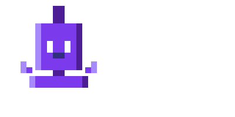

<!-- CAPSULE WAVE HEADER -->
<p align="center">
  
</p>

<div align="center">

<!-- ROTATING TYPING HEADLINES -->


<br><br>

<!-- 3D ROTATING ASCII WELCOME SVG BANNER -->


<br><br>

<!-- OFFICIAL BRAND LOGO IN CIRCULAR FRAME -->
<div style="display: inline-block; border: 3px solid #8B5CF6; border-radius: 50%; padding: 4px; background: #08080C; box-shadow: 0 0 15px rgba(139, 92, 246, 0.4);">
  
</div>

<br><br>

<!-- TACTICAL CORE SHIELDS -->
[](#)
[](#)
[](#)
[](#)

<br><br>

<sub>Profile views: </sub>

</div>

<br>

<!-- COMMAND OVERVIEW GRID -->
<table width="100%" border="0" cellpadding="10" cellspacing="0" style="background-color: #08080C; border: 1px solid #3B3E52; border-collapse: collapse;">
  <tr style="background-color: #0E0F17; border-bottom: 1px solid #3B3E52;">
    <th align="left" style="color: #8B5CF6; font-family: 'Fira Code', monospace; padding: 12px; font-size: 1.1em;">⚡ SYSTEM DIRECTIVE & MISSION BRIEFING</th>
    <th align="left" width="300" style="color: #EF4444; font-family: 'Fira Code', monospace; padding: 12px; font-size: 1.1em;">📟 LIVE TELEMETRY HUD</th>
  </tr>
  <tr>
    <td valign="top" style="color: #E2E8F0; font-family: 'Segoe UI', Tahoma, Geneva, Verdana, sans-serif; line-height: 1.6; padding: 15px;">
      <strong>Vortex Systems And Defenses (VSAD)</strong> operates at the bleeding edge of defense innovation, aerospace engineering, and autonomous technologies. Our core mandate is the engineering of ultra-high-speed aerodynamics, next-generation propulsion, and multi-agent AI orchestration networks (ORBIT).
      <br><br>
      Through custom low-level compilers (Sloter) and autonomous swarm systems, VSAD bridges the physical and cognitive battlefields, securing technological sovereignty and physical superiority.
    </td>
    <td valign="top" style="background-color: #0E0F17; border-left: 1px solid #3B3E52; padding: 15px;">
      <pre style="color: #8B5CF6; font-family: 'Fira Code', monospace; margin: 0; line-height: 1.5; font-size: 0.9em;">
┌──────────────────────────────┐
│  VSAD METRIC   │ VALUE       │
├──────────────────────────────┤
│  LATENCY       │ 0.04 ms     │
│  UPTIME        │ 99.99%      │
│  SYSTEM MODE   │ DEFENSE_R&D │
│  THREAT LEVEL  │ ULTRA-LOW   │
│  SWARM STATE   │ OPTIMAL     │
│  CORES ACTIVE  │ 1024/1024   │
└──────────────────────────────┘</pre>
    </td>
  </tr>
</table>

<br>

<!-- COMMAND COMMUNICATION HUBS (AWESOME COMPONENT INTERACTIVE CARDS) -->
<h2 align="left" style="color: #8B5CF6; font-family: 'Fira Code', monospace; border-bottom: 2px solid #3B3E52; padding-bottom: 8px;">📡 COMMAND COMMUNICATION HUBS</h2>

<table width="100%" border="0" cellpadding="8" style="background-color: #08080C; border-collapse: collapse; text-align: center;">
  <tr>
    <td width="25%" style="border: 1px solid #3B3E52; background: #0E0F17;">
      <a href="https://www.youtube.com/@thevsad">
        
        <br><span style="font-family: 'Fira Code', monospace; font-size: 0.8em; color: #E2E8F0;">Official Broadcasts</span>
      </a>
    </td>
    <td width="25%" style="border: 1px solid #3B3E52; background: #0E0F17;">
      <a href="https://x.com/VsadTech">
        
        <br><span style="font-family: 'Fira Code', monospace; font-size: 0.8em; color: #E2E8F0;">Tactical Updates</span>
      </a>
    </td>
    <td width="25%" style="border: 1px solid #3B3E52; background: #0E0F17;">
      <a href="https://discord.gg/vsadlabs">
        
        <br><span style="font-family: 'Fira Code', monospace; font-size: 0.8em; color: #E2E8F0;">Secure Node Chat</span>
      </a>
    </td>
    <td width="25%" style="border: 1px solid #3B3E52; background: #0E0F17;">
      <a href="mailto:vsad.pvt@gmail.com">
        
        <br><span style="font-family: 'Fira Code', monospace; font-size: 0.8em; color: #E2E8F0;">Comms Line</span>
      </a>
    </td>
  </tr>
</table>

<br>

<!-- QUICK FACTS -->
<h2 align="left" style="color: #8B5CF6; font-family: 'Fira Code', monospace; border-bottom: 2px solid #3B3E52; padding-bottom: 8px; margin-top: 30px;">⚡ QUICK FACTS</h2>

- **What VSAD is:** a 14-division technology holding operation — AI orchestration, robotics, aerospace R&D, cybersecurity, SaaS, nanotech, and DeFi under one roof.
- **Scale:** 700+ technical documents · 55+ project directories · 300 deep-research files · 12 revenue playbooks.
- **Shipping now:** ORBIT AI Agents, Sloter (custom language + compiler), Craft Panel, API Suite — all 🟢 active.
- **Financial horizon:** $6M ARR target for 2028, scaling to $2B ARR by 2035.
- **Read next:** [Order of Battle](#-strategic-order-of-battle) → [Project Portfolio](#-strategic-artifacts--project-portfolio) → [Tech Stack](#-tactical-tech-matrix-68-stacks) → [Command Center](#-command-center).

<br>

<!-- COMMAND STRUCTURE -->
<h2 align="left" style="color: #8B5CF6; font-family: 'Fira Code', monospace; border-bottom: 2px solid #3B3E52; padding-bottom: 8px; margin-top: 30px;">🏛️ COMMAND STRUCTURE</h2>

```
                              ┌───────────────────────────────┐
                              │          VSAD COMMAND         │
                              │   Owner Vsad — Founder & CEO  │
                              └────────────────┬──────────────┘
                                               │
        ┌───────────────────┬───────────────────┼────────────────────┬─────────────────────┐
        │                   │                   │                    │                     │
┌───────┴───────┐   ┌───────┴───────┐  ┌────────┴──────────┐ ┌───────┴───────┐   ┌─────────┴─────────┐
│ STRATEGIC DIV │   │ OPERATIONAL   │  │     R&D DIV       │ │  SPECIAL DIV  │   │  AI & DATA (QAVI) │
│  5 Divisions  │   │  3 Divisions  │  │     4 Units       │ │  2 Divisions  │   │   + FINANCE CMD   │
└───────────────┘   └───────────────┘  └───────────────────┘ └───────────────┘   └───────────────────┘
```

<br>

<!-- STRATEGIC ORDER OF BATTLE (14 DIVISIONS) -->
<h2 align="left" style="color: #8B5CF6; font-family: 'Fira Code', monospace; border-bottom: 2px solid #3B3E52; padding-bottom: 8px; margin-top: 30px;">⚔️ STRATEGIC ORDER OF BATTLE</h2>

<table width="100%" style="background-color: #08080C; border: 1px solid #3B3E52; border-collapse: collapse; font-family: 'Fira Code', monospace; font-size: 0.95em;">
  <thead>
    <tr style="background-color: #0E0F17; border-bottom: 2px solid #3B3E52; color: #8B5CF6;">
      <th width="15%" align="center" style="padding: 10px; border-right: 1px solid #3B3E52;">SECTOR</th>
      <th width="10%" align="center" style="padding: 10px; border-right: 1px solid #3B3E52;">CODE</th>
      <th width="35%" align="left" style="padding: 10px; border-right: 1px solid #3B3E52;">DIVISION NAME</th>
      <th width="40%" align="left" style="padding: 10px;">OPERATIONAL DOMAIN</th>
    </tr>
  </thead>
  <tbody>
    <!-- STRATEGIC SECTOR -->
    <tr style="border-bottom: 1px solid #1F222E;">
      <td rowspan="5" align="center" valign="middle" style="background-color: #0E0F17; color: #EF4444; font-weight: bold; border-right: 1px solid #3B3E52; border-bottom: 1px solid #3B3E52;">STRATEGIC</td>
      <td align="center" style="color: #8B5CF6; border-right: 1px solid #3B3E52; padding: 8px;">AF</td>
      <td style="color: #E2E8F0; border-right: 1px solid #3B3E52; padding: 8px; font-weight: bold;">Air Fleets</td>
      <td style="color: #E2E8F0; padding: 8px;">Autonomous drone swarms & tactical RC aviation platforms.</td>
    </tr>
    <tr style="border-bottom: 1px solid #1F222E;">
      <td align="center" style="color: #8B5CF6; border-right: 1px solid #3B3E52; padding: 8px;">MSOD</td>
      <td style="color: #E2E8F0; border-right: 1px solid #3B3E52; padding: 8px; font-weight: bold;">Mass Source of De*truction</td>
      <td style="color: #E2E8F0; padding: 8px;">Large-scale Military Missiles Engineering and danguress damage projectile Developement.</td>
    </tr>
    <tr style="border-bottom: 1px solid #1F222E;">
      <td align="center" style="color: #8B5CF6; border-right: 1px solid #3B3E52; padding: 8px;">VHVPs</td>
      <td style="color: #E2E8F0; border-right: 1px solid #3B3E52; padding: 8px; font-weight: bold;">Very High Velocity Projectiles</td>
      <td style="color: #E2E8F0; padding: 8px;">High-speed hypersonic aerodynamics & projectile dynamics.</td>
    </tr>
    <tr style="border-bottom: 1px solid #1F222E;">
      <td align="center" style="color: #8B5CF6; border-right: 1px solid #3B3E52; padding: 8px;">SS</td>
      <td style="color: #E2E8F0; border-right: 1px solid #3B3E52; padding: 8px; font-weight: bold;">Sky Spirits</td>
      <td style="color: #E2E8F0; padding: 8px;">Advanced Super Fast high-altitude Stealthy Missile Systems.</td>
    </tr>
    <tr style="border-bottom: 1px solid #3B3E52;">
      <td align="center" style="color: #8B5CF6; border-right: 1px solid #3B3E52; padding: 8px;">MPMS</td>
      <td style="color: #E2E8F0; border-right: 1px solid #3B3E52; padding: 8px; font-weight: bold;">Multi-Purpose Missile Systems</td>
      <td style="color: #E2E8F0; padding: 8px;">Highly versatile, quick-deploy platform engineering, missile systems & design.</td>
    </tr>
    <!-- OPERATIONAL SECTOR -->
    <tr style="border-bottom: 1px solid #1F222E;">
      <td rowspan="3" align="center" valign="middle" style="background-color: #0E0F17; color: #EF4444; font-weight: bold; border-right: 1px solid #3B3E52; border-bottom: 1px solid #3B3E52;">OPERATIONAL</td>
      <td align="center" style="color: #8B5CF6; border-right: 1px solid #3B3E52; padding: 8px;">GF</td>
      <td style="color: #E2E8F0; border-right: 1px solid #3B3E52; padding: 8px; font-weight: bold;">Ground Fleets</td>
      <td style="color: #E2E8F0; padding: 8px;">High-performance tactical RC ground vehicles & unmanned ground systems.</td>
    </tr>
    <tr style="border-bottom: 1px solid #1F222E;">
      <td align="center" style="color: #8B5CF6; border-right: 1px solid #3B3E52; padding: 8px;">CSLs</td>
      <td style="color: #E2E8F0; border-right: 1px solid #3B3E52; padding: 8px; font-weight: bold;">Cyber Slots.</td>
      <td style="color: #E2E8F0; padding: 8px;">Deep layered security architectures, penetration vectors, and net-defense and attack layer.</td>
    </tr>
    <tr style="border-bottom: 1px solid #3B3E52;">
      <td align="center" style="color: #8B5CF6; border-right: 1px solid #3B3E52; padding: 8px;">ABI</td>
      <td style="color: #E2E8F0; border-right: 1px solid #3B3E52; padding: 8px; font-weight: bold;">Animatronics beyong Imagination.</td>
      <td style="color: #E2E8F0; padding: 8px;">Robotics, advanced animatronics, and hybrid actuator Intelligence Systems.</td>
    </tr>
    <!-- R&D SECTOR -->
    <tr style="border-bottom: 1px solid #1F222E;">
      <td rowspan="4" align="center" valign="middle" style="background-color: #0E0F17; color: #EF4444; font-weight: bold; border-right: 1px solid #3B3E52; border-bottom: 1px solid #3B3E52;">R&D</td>
      <td align="center" style="color: #8B5CF6; border-right: 1px solid #3B3E52; padding: 8px;">BHOI</td>
      <td style="color: #E2E8F0; border-right: 1px solid #3B3E52; padding: 8px; font-weight: bold;">Black Hole of Innovation</td>
      <td style="color: #E2E8F0; padding: 8px;">Cross-disciplinary deep tech incubation, Deep Interent Research and Proper development Division.</td>
    </tr>
    <tr style="border-bottom: 1px solid #1F222E;">
      <td align="center" style="color: #8B5CF6; border-right: 1px solid #3B3E52; padding: 8px;">VOX-VEIL</td>
      <td style="color: #E2E8F0; border-right: 1px solid #3B3E52; padding: 8px; font-weight: bold;">Voice & Encrypted Intel</td>
      <td style="color: #E2E8F0; padding: 8px;">Secure low-latency voice, encryption protocols, and anti-intercept lines that nobody unless people in Vsad Know.</td>
    </tr>
    <tr style="border-bottom: 1px solid #1F222E;">
      <td align="center" style="color: #8B5CF6; border-right: 1px solid #3B3E52; padding: 8px;">NM</td>
      <td style="color: #E2E8F0; border-right: 1px solid #3B3E52; padding: 8px; font-weight: bold;">Nano Motes</td>
      <td style="color: #E2E8F0; padding: 8px;">Micro-electromechanical systems (MEMS) & molecular scale fabrication.</td>
    </tr>
    <tr style="border-bottom: 1px solid #3B3E52;">
      <td align="center" style="color: #8B5CF6; border-right: 1px solid #3B3E52; padding: 8px;">QAVI</td>
      <td style="color: #E2E8F0; border-right: 1px solid #3B3E52; padding: 8px; font-weight: bold;">Quasar Atrificial Vortex Intelgence</td>
      <td style="color: #E2E8F0; padding: 8px;">Neural agent orchestration, autonomous swarms, and cognitive LLM and Development Division.</td>
    </tr>
    <!-- SPECIAL SECTOR -->
    <tr style="border-bottom: 1px solid #1F222E;">
      <td rowspan="2" align="center" valign="middle" style="background-color: #0E0F17; color: #EF4444; font-weight: bold; border-right: 1px solid #3B3E52;">SPECIAL</td>
      <td align="center" style="color: #8B5CF6; border-right: 1px solid #3B3E52; padding: 8px;">DH</td>
      <td style="color: #E2E8F0; border-right: 1px solid #3B3E52; padding: 8px; font-weight: bold;">Direct Hit</td>
      <td style="color: #E2E8F0; padding: 8px;">Rapid prototyping, urgent operational deployments, and special ops tech with high-acuracy.</td>
    </tr>
    <tr>
      <td align="center" style="color: #8B5CF6; border-right: 1px solid #3B3E52; padding: 8px;">CONRAS</td>
      <td style="color: #E2E8F0; border-right: 1px solid #3B3E52; padding: 8px; font-weight: bold;">Computing Operational Networked Researched Arbitral Systems</td>
      <td style="color: #E2E8F0; padding: 8px;">Computing hardware & advanced networked cluster topologies.</td>
    </tr>
  </tbody>
</table>

<br>

<!-- PROJECT PORTFOLIO -->
<h2 align="left" style="color: #8B5CF6; font-family: 'Fira Code', monospace; border-bottom: 2px solid #3B3E52; padding-bottom: 8px; margin-top: 30px;">📂 STRATEGIC ARTIFACTS & PROJECT PORTFOLIO</h2>

<table width="100%" style="background-color: #08080C; border: 1px solid #3B3E52; border-collapse: collapse; font-family: 'Fira Code', monospace; font-size: 0.95em;">
  <thead>
    <tr style="background-color: #0E0F17; border-bottom: 2px solid #3B3E52; color: #8B5CF6;">
      <th align="left" style="padding: 10px; border-right: 1px solid #3B3E52;">PROJECT ID</th>
      <th align="left" style="padding: 10px; border-right: 1px solid #3B3E52;">CATEGORY</th>
      <th align="left" style="padding: 10px; border-right: 1px solid #3B3E52;">DESCRIPTION</th>
      <th align="center" style="padding: 10px;">TACTICAL STATUS</th>
    </tr>
  </thead>
  <tbody>
    <tr style="border-bottom: 1px solid #1F222E;">
      <td style="color: #8B5CF6; border-right: 1px solid #3B3E52; padding: 10px; font-weight: bold;">👽Alien Mode</td>
      <td style="color: #E2E8F0; border-right: 1px solid #3B3E52; padding: 10px;">Context & High Cognitive AI Agent FrameWork</td>
      <td style="color: #E2E8F0; padding: 10px;">Proper Skill and Context Injection to AI Agents with High Level skills developed by proper R&d</td>
      <td align="center" style="padding: 10px;"><span style="color: #8B5CF6; font-weight: bold;">In Rapid Development</span></td>
    </tr>
    <tr style="border-bottom: 1px solid #1F222E;">
      <td style="color: #8B5CF6; border-right: 1px solid #3B3E52; padding: 10px; font-weight: bold;">SLOTER Language & Compiler</td>
      <td style="color: #E2E8F0; border-right: 1px solid #3B3E52; padding: 10px;">Programming Language development & Engineering</td>
      <td style="color: #E2E8F0; padding: 10px;">Custom systems language & high-performance compiler Project.</td>
      <td align="center" style="padding: 10px;"><span style="color: #8B5CF6; font-weight: bold;">Side Development</span></td>
    </tr>
    <tr style="border-bottom: 1px solid #1F222E;">
      <td style="color: #8B5CF6; border-right: 1px solid #3B3E52; padding: 10px; font-weight: bold;">MovdeoaaMM</td>
      <td style="color: #E2E8F0; border-right: 1px solid #3B3E52; padding: 10px;">Full-Stack Aerospace Engineering Framework</td>
      <td style="color: #E2E8F0; padding: 10px;">Unified aerospace Engine and Framework.</td>
      <td align="center" style="padding: 10px;"><span style="color: #8B5CF6; font-weight: bold;">Rapid Development</span></td>
    </tr>
    <tr>
      <td style="color: #8B5CF6; border-right: 1px solid #3B3E52; padding: 10px; font-weight: bold;">PROVEX</td>
      <td style="color: #E2E8F0; border-right: 1px solid #3B3E52; padding: 10px;">Crypto Competitions</td>
      <td style="color: #E2E8F0; padding: 10px;">High-concurrency hackathon/competition scaling platform.</td>
      <td align="center" style="padding: 10px;"><span style="color: #EF4444; font-weight: bold;">🔒 For Sale whole Project - Contact me.</span></td>
    </tr>
  </tbody>
</table>

<br>

<!-- PRIMARY DEVELOPMENT ENVIRONMENT (PROPER ZED LOGO) -->
<h2 align="left" style="color: #8B5CF6; font-family: 'Fira Code', monospace; border-bottom: 2px solid #3B3E52; padding-bottom: 8px; margin-top: 30px;">⚡ PRIMARY DEVELOPMENT ENVIRONMENT</h2>

<div align="center">

<a href="https://zed.dev/">
  
</a>

<br><br>

<!-- PROPER OFFICIAL ZED EDITOR ICON -->
<a href="https://zed.dev/">
  
</a>

<br><br>

### **Zed**

**The primary editor behind VSAD development.**

Fast native performance · AI-native workflow · Keyboard-first engineering · Minimal interface

<br>

[](https://zed.dev/)
[](https://github.com/zed-industries/zed)
[](https://zed.dev/)

</div>

> **VSAD Editor Standard:** Zed is the default development environment for VSAD.
> Built for speed, precision, AI-assisted engineering, and focused system development.

### Why Zed?

| Capability                  | Role in VSAD                                    |
| --------------------------- | ----------------------------------------------- |
| ⚡ **Native Performance**    | Fast, responsive development environment        |
| 🤖 **AI-Native**            | AI-assisted coding directly inside the editor   |
| ⌨️ **Keyboard-First**       | High-speed, distraction-free workflow           |
| 🧩 **Extensible**           | Language support, themes, snippets, and tooling |
| 🛠️ **Engineering Focused** | Designed around serious software development    |

<br>

<!-- TECH MATRIX -->
<h2 align="left" style="color: #8B5CF6; font-family: 'Fira Code', monospace; border-bottom: 2px solid #3B3E52; padding-bottom: 8px; margin-top: 30px;">💻 TACTICAL TECH MATRIX (68+ STACKS)</h2>

<table width="100%" style="background-color: #08080C; border: 1px solid #3B3E52; border-collapse: collapse; font-family: 'Fira Code', monospace; font-size: 0.95em; color: #E2E8F0;">
  <tr style="background-color: #0E0F17; border-bottom: 1px solid #3B3E52;">
    <th width="25%" align="left" style="padding: 10px; color: #8B5CF6; border-right: 1px solid #3B3E52;">CATEGORY</th>
    <th width="75%" align="left" style="padding: 10px;">INTEGRATED ENVIRONMENTS &amp; TOOLSETS (DARK PRESENTS)</th>
  </tr>
  <tr style="border-bottom: 1px solid #1F222E;">
    <td style="padding: 10px; font-weight: bold; border-right: 1px solid #3B3E52; color: #EF4444;">1. LANGUAGES</td>
    <td style="padding: 10px;">
      
    </td>
  </tr>
  <tr style="border-bottom: 1px solid #1F222E;">
    <td style="padding: 10px; font-weight: bold; border-right: 1px solid #3B3E52; color: #EF4444;">2. FRONTEND</td>
    <td style="padding: 10px;">
      
    </td>
  </tr>
  <tr style="border-bottom: 1px solid #1F222E;">
    <td style="padding: 10px; font-weight: bold; border-right: 1px solid #3B3E52; color: #EF4444;">3. BACKEND &amp; APIS</td>
    <td style="padding: 10px;">
      
    </td>
  </tr>
  <tr style="border-bottom: 1px solid #1F222E;">
    <td style="padding: 10px; font-weight: bold; border-right: 1px solid #3B3E52; color: #EF4444;">4. DATA &amp; MSG</td>
    <td style="padding: 10px;">
      
    </td>
  </tr>
  <tr style="border-bottom: 1px solid #1F222E;">
    <td style="padding: 10px; font-weight: bold; border-right: 1px solid #3B3E52; color: #EF4444;">5. DEVOPS &amp; CLOUD</td>
    <td style="padding: 10px;">
      
    </td>
  </tr>
  <tr style="border-bottom: 1px solid #1F222E;">
    <td style="padding: 10px; font-weight: bold; border-right: 1px solid #3B3E52; color: #EF4444;">6. AI, ML &amp; EMB</td>
    <td style="padding: 10px;">
      
    </td>
  </tr>
  <tr style="border-bottom: 1px solid #1F222E;">
    <td style="padding: 10px; font-weight: bold; border-right: 1px solid #3B3E52; color: #EF4444;">7. HARDWARE &amp; LOW LEVEL</td>
    <td style="padding: 10px;">
      
      
      
      
      
    </td>
  </tr>
  <tr style="border-bottom: 1px solid #1F222E;">
    <td style="padding: 10px; font-weight: bold; border-right: 1px solid #3B3E52; color: #EF4444;">8. TOOLING</td>
    <td style="padding: 10px;">
      
    </td>
  </tr>
  <tr>
    <td style="padding: 10px; font-weight: bold; border-right: 1px solid #3B3E52; color: #EF4444;">9. WEB3 &amp; CRYPTO</td>
    <td style="padding: 10px;">
      
    </td>
  </tr>
</table>

<br>

<details>
  <summary style="font-family: 'Fira Code', monospace; color: #8B5CF6; font-size: 1.1em; font-weight: bold; cursor: pointer; outline: none;">📦 COLLAPSIBLE EXTENDED TOOLCHAIN</summary>
  <div style="background-color: #08080C; border: 1px solid #3B3E52; padding: 15px; margin-top: 10px; border-radius: 6px; font-family: 'Fira Code', monospace; font-size: 0.9em; color: #E2E8F0;">
    <table width="100%" style="border-collapse: collapse;">
      <tr style="border-bottom: 1px solid #1F222E;">
        <td width="30%" style="padding: 8px 0; font-weight: bold; color: #EF4444;">PACKAGE &amp; BUILD</td>
        <td style="padding: 8px 0;"><code>pnpm</code> · <code>Vite</code> · <code>Webpack</code> · <code>Turborepo</code> · <code>esbuild</code> · <code>Cargo</code></td>
      </tr>
      <tr style="border-bottom: 1px solid #1F222E;">
        <td style="padding: 8px 0; font-weight: bold; color: #EF4444;">TESTING &amp; QUALITY</td>
        <td style="padding: 8px 0;"><code>Jest</code> · <code>Vitest</code> · <code>Cypress</code> · <code>Selenium</code> · <code>ESLint</code> · <code>Prettier</code></td>
      </tr>
      <tr style="border-bottom: 1px solid #1F222E;">
        <td style="padding: 8px 0; font-weight: bold; color: #EF4444;">BaaS &amp; DB LAYERS</td>
        <td style="padding: 8px 0;"><code>Supabase</code> · <code>Firebase</code> · <code>PlanetScale</code> · <code>Prisma</code> · <code>Upstash</code></td>
      </tr>
      <tr style="border-bottom: 1px solid #1F222E;">
        <td style="padding: 8px 0; font-weight: bold; color: #EF4444;">API &amp; ARCHITECTURE</td>
        <td style="padding: 8px 0;"><code>tRPC</code> · <code>Zod</code> · <code>REST</code> · <code>gRPC</code> · <code>WebSockets</code></td>
      </tr>
      <tr>
        <td style="padding: 8px 0; font-weight: bold; color: #EF4444;">MONITORING</td>
        <td style="padding: 8px 0;"><code>Sentry</code> · <code>Datadog</code> · <code>OpenTelemetry</code></td>
      </tr>
    </table>
  </div>
</details>

<br>

<!-- TELEMETRY & ANALYTICS -->

<h2 align="left">📊 LIVE NETWORK TELEMETRY &amp; ANALYTICS</h2>

| GitHub Statistics | Most Used Languages |
|:---:|:---:|
|  |  |

<br>

### CONTRIBUTION ACTIVITY

<p align="center">
  
</p>

<br>

### CONTRIBUTION SNAKE

<p align="center">
  
</p>

<br>

<div style="background-color: #0E0F17; border: 1px solid #3B3E52; border-left: 4px solid #EF4444; padding: 12px; font-family: 'Fira Code', monospace; color: #E2E8F0; font-size: 0.95em; border-radius: 4px;">
  <strong>SYSTEMIC RESOURCE ALLOCATION PROTOCOL:</strong>
  <br>
  Deep R&amp;D Focus: <code>30%</code> | Infrastructure Operations: <code>40%</code> | Swarm Growth: <code>20%</code> | Capital Reserves: <code>10%</code>
</div>

<br>

<!-- COMMAND CENTER -->
<h2 align="left" style="color: #8B5CF6; font-family: 'Fira Code', monospace; border-bottom: 2px solid #3B3E52; padding-bottom: 8px; margin-top: 30px;">📍 COMMAND CENTER</h2>

| RESOURCE REGISTRY | PURPOSE &amp; FOCUS AREA |
|---|---|
| **VSAD Master Index** | Central navigation hub for all operational directories. |
| **VSAD Command Hierarchy** | Complete organizational layout and clearance list. |
| **Company OS** | Core operating procedures, frameworks, and system protocols. |
| **Vision &amp; Strategy** | Long-term tactical roadmap and technological horizons. |
| **Economic Dashboard** | Financial stream ledger, projections, and ARR trackers. |
| **VSAD Earning Methods** | 12 comprehensive revenue generation playbooks. |
| **Active Ops Dashboard** | Real-time project status and deployment priorities. |
| **Research Command Center** | Progress matrices for hypersonics, robotics, and neural nets. |

<br>

<br><hr style="border: 1px solid #3B3E52;"><br>

<!-- PROPRIETARY FOOTER WITH BYEBYE ASCII -->
<div align="center">
  
  <br><br>
  
  <br>
  <p style="color: #E2E8F0; font-family: 'Fira Code', monospace; font-size: 0.9em; margin-top: 5px;">
    VORTEX SYSTEMS AND DEFENSES — PROPRIETARY DEFENSE MATRIX © 2026-2035
    <br>
    <span style="color: #8B5CF6;">BUILD IN SILENCE. LET THE EMPIRE SPEAK.</span>
  </p>
</div>
